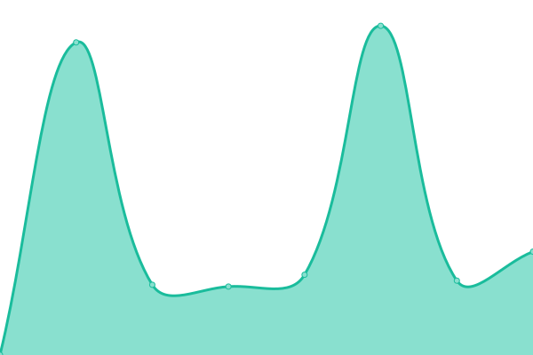

# [📈 Live Status](https://MTES-MCT.github.io/upptime): <!--live status--> **🟧 Partial outage**

This repository contains the open-source uptime monitor and status page for [Ministères de la Transition écologique & de la Cohésion des territoires](https://ecologie.gouv.fr/), powered by [Upptime](https://github.com/upptime/upptime).

With [Upptime](https://upptime.js.org), you can get your own unlimited and free uptime monitor and status page, powered entirely by a GitHub repository. We use [Issues](https://github.com/MTES-MCT/upptime/issues) as incident reports, [Actions](https://github.com/MTES-MCT/upptime/actions) as uptime monitors, and [Pages](https://MTES-MCT.github.io/upptime) for the status page.

<!--start: status pages-->
<!-- This summary is generated by Upptime (https://github.com/upptime/upptime) -->
<!-- Do not edit this manually, your changes will be overwritten -->
<!-- prettier-ignore -->
| URL | Status | History | Response Time | Uptime |
| --- | ------ | ------- | ------------- | ------ |
|  [Acceslibre](https://acceslibre.beta.gouv.fr) | 🟩 Up | [acceslibre.yml](https://github.com/MTES-MCT/upptime/commits/HEAD/history/acceslibre.yml) | 

 806ms
     
 | 

<a href="https://MTES-MCT.github.io/upptime/history/acceslibre">100.00%</a>
    

|  [Adock](https://adock.beta.gouv.fr) | 🟩 Up | [adock.yml](https://github.com/MTES-MCT/upptime/commits/HEAD/history/adock.yml) | 

 569ms
     
 | 

<a href="https://MTES-MCT.github.io/upptime/history/adock">100.00%</a>
    

|  [Apilos](https://apilos.beta.gouv.fr) | 🟩 Up | [apilos.yml](https://github.com/MTES-MCT/upptime/commits/HEAD/history/apilos.yml) | 

 861ms
     
 | 

<a href="https://MTES-MCT.github.io/upptime/history/apilos">100.00%</a>
    

|  [Aides territoires](https://aides-territoires.beta.gouv.fr) | 🟩 Up | [aides-territoires.yml](https://github.com/MTES-MCT/upptime/commits/HEAD/history/aides-territoires.yml) | 

 860ms
     
 | 

<a href="https://MTES-MCT.github.io/upptime/history/aides-territoires">100.00%</a>
    

|  [Camino](https://camino.beta.gouv.fr) | 🟩 Up | [camino.yml](https://github.com/MTES-MCT/upptime/commits/HEAD/history/camino.yml) | 

 760ms
     
 | 

<a href="https://MTES-MCT.github.io/upptime/history/camino">100.00%</a>
    

|  [Camino API](https://api.camino.beta.gouv.fr/?operationName=Titres&query=query%20Titres%20%7B%0A%20%20titres%20%7B%0A%20%20%20%20elements%20%7B%0A%20%20%20%20%20%20id%0A%20%20%20%20%7D%0A%20%20%7D%0A%7D%0A) | 🟩 Up | [camino-api.yml](https://github.com/MTES-MCT/upptime/commits/HEAD/history/camino-api.yml) | 

 1454ms
     
 | 

<a href="https://MTES-MCT.github.io/upptime/history/camino-api">100.00%</a>
    

|  [Carbure](https://carbure.beta.gouv.fr) | 🟩 Up | [carbure.yml](https://github.com/MTES-MCT/upptime/commits/HEAD/history/carbure.yml) | 

 734ms
     
 | 

<a href="https://MTES-MCT.github.io/upptime/history/carbure">100.00%</a>
    

|  [Chauffage-urbain](https://chauffage-urbain.beta.gouv.fr) | 🟩 Up | [chauffage-urbain.yml](https://github.com/MTES-MCT/upptime/commits/HEAD/history/chauffage-urbain.yml) | 

 1192ms
     
 | 

<a href="https://MTES-MCT.github.io/upptime/history/chauffage-urbain">100.00%</a>
    

|  [Covoiturage](https://covoiturage.beta.gouv.fr) | 🟩 Up | [covoiturage.yml](https://github.com/MTES-MCT/upptime/commits/HEAD/history/covoiturage.yml) | 

 712ms
     
 | 

<a href="https://MTES-MCT.github.io/upptime/history/covoiturage">100.00%</a>
    

|  [Dossier facile landpage](https://dossierfacile.fr) | 🟩 Up | [dossier-facile-landpage.yml](https://github.com/MTES-MCT/upptime/commits/HEAD/history/dossier-facile-landpage.yml) | 

 1107ms
     
 | 

<a href="https://MTES-MCT.github.io/upptime/history/dossier-facile-landpage">100.00%</a>
    

|  [Dossier facile propriétaire](https://proprietaire.dossierfacile.fr) | 🟩 Up | [dossier-facile-proprietaire.yml](https://github.com/MTES-MCT/upptime/commits/HEAD/history/dossier-facile-proprietaire.yml) | 

 539ms
     
 | 

<a href="https://MTES-MCT.github.io/upptime/history/dossier-facile-proprietaire">100.00%</a>
    

|  [Dossier facile locataire](https://locataire.dossierfacile.fr) | 🟩 Up | [dossier-facile-locataire.yml](https://github.com/MTES-MCT/upptime/commits/HEAD/history/dossier-facile-locataire.yml) | 

 471ms
     
 | 

<a href="https://MTES-MCT.github.io/upptime/history/dossier-facile-locataire">100.00%</a>
    

|  [API Dossier facile](https://api.dossierfacile.fr/actuator/health) | 🟩 Up | [api-dossier-facile.yml](https://github.com/MTES-MCT/upptime/commits/HEAD/history/api-dossier-facile.yml) | 

 491ms
     
 | 

<a href="https://MTES-MCT.github.io/upptime/history/api-dossier-facile">100.00%</a>
    

|  [Envergo](https://envergo.beta.gouv.fr) | 🟩 Up | [envergo.yml](https://github.com/MTES-MCT/upptime/commits/HEAD/history/envergo.yml) | 

 857ms
     
 | 

<a href="https://MTES-MCT.github.io/upptime/history/envergo">100.00%</a>
    

|  [France-chaleur-urbaine](https://france-chaleur-urbaine.beta.gouv.fr) | 🟩 Up | [france-chaleur-urbaine.yml](https://github.com/MTES-MCT/upptime/commits/HEAD/history/france-chaleur-urbaine.yml) | 

 471ms
     
 | 

<a href="https://MTES-MCT.github.io/upptime/history/france-chaleur-urbaine">100.00%</a>
    

|  [Le Taxi](https://le.taxi) | 🟩 Up | [le-taxi.yml](https://github.com/MTES-MCT/upptime/commits/HEAD/history/le-taxi.yml) | 

 800ms
     
 | 

<a href="https://MTES-MCT.github.io/upptime/history/le-taxi">100.00%</a>
    

|  [Le Taxi API](https://dev.api.taxi/hails) | 🟥 Down | [le-taxi-api.yml](https://github.com/MTES-MCT/upptime/commits/HEAD/history/le-taxi-api.yml) | 

 820ms
     
 | 

<a href="https://MTES-MCT.github.io/upptime/history/le-taxi-api">100.00%</a>
    

|  [Mobilic](https://mobilic.beta.gouv.fr) | 🟩 Up | [mobilic.yml](https://github.com/MTES-MCT/upptime/commits/HEAD/history/mobilic.yml) | 

 558ms
     
 | 

<a href="https://MTES-MCT.github.io/upptime/history/mobilic">100.00%</a>
    

|  [Partaj](https://partaj.beta.gouv.fr) | 🟩 Up | [partaj.yml](https://github.com/MTES-MCT/upptime/commits/HEAD/history/partaj.yml) | 

 846ms
     
 | 

<a href="https://MTES-MCT.github.io/upptime/history/partaj">100.00%</a>
    

|  [Potentiel](https://potentiel.beta.gouv.fr) | 🟩 Up | [potentiel.yml](https://github.com/MTES-MCT/upptime/commits/HEAD/history/potentiel.yml) | 

 903ms
     
 | 

<a href="https://MTES-MCT.github.io/upptime/history/potentiel">100.00%</a>
    

|  [Résorptions des bidonvilles](https://resorption-bidonvilles.beta.gouv.fr) | 🟩 Up | [resorptions-des-bidonvilles.yml](https://github.com/MTES-MCT/upptime/commits/HEAD/history/resorptions-des-bidonvilles.yml) | 

 852ms
     
 | 

<a href="https://MTES-MCT.github.io/upptime/history/resorptions-des-bidonvilles">100.00%</a>
    

|  [Trackdechets](https://trackdechets.beta.gouv.fr) | 🟩 Up | [trackdechets.yml](https://github.com/MTES-MCT/upptime/commits/HEAD/history/trackdechets.yml) | 

 324ms
     
 | 

<a href="https://MTES-MCT.github.io/upptime/history/trackdechets">100.00%</a>
    

|  [Sparte](https://sparte.beta.gouv.fr) | 🟩 Up | [sparte.yml](https://github.com/MTES-MCT/upptime/commits/HEAD/history/sparte.yml) | 

 627ms
     
 | 

<a href="https://MTES-MCT.github.io/upptime/history/sparte">100.00%</a>
    

|  [Trackdechets API](https://api.trackdechets.beta.gouv.fr/.well-known/apollo/server-health) | 🟩 Up | [trackdechets-api.yml](https://github.com/MTES-MCT/upptime/commits/HEAD/history/trackdechets-api.yml) | 

 667ms
     
 | 

<a href="https://MTES-MCT.github.io/upptime/history/trackdechets-api">100.00%</a>
    

|  [Transport data](https://transport.data.gouv.fr) | 🟩 Up | [transport-data.yml](https://github.com/MTES-MCT/upptime/commits/HEAD/history/transport-data.yml) | 

 824ms
     
 | 

<a href="https://MTES-MCT.github.io/upptime/history/transport-data">100.00%</a>
    

|  [Transport data API](https://transport.data.gouv.fr/api/datasets) | 🟩 Up | [transport-data-api.yml](https://github.com/MTES-MCT/upptime/commits/HEAD/history/transport-data-api.yml) | 

 1426ms
     
 | 

<a href="https://MTES-MCT.github.io/upptime/history/transport-data-api">100.00%</a>
    

|  [Wikicarbone](https://wikicarbone.beta.gouv.fr) | 🟩 Up | [wikicarbone.yml](https://github.com/MTES-MCT/upptime/commits/HEAD/history/wikicarbone.yml) | 

 958ms
     
 | 

<a href="https://MTES-MCT.github.io/upptime/history/wikicarbone">100.00%</a>
    

|  [ZeroLogementVacant](https://zerologementvacant.beta.gouv.fr) | 🟩 Up | [zero-logement-vacant.yml](https://github.com/MTES-MCT/upptime/commits/HEAD/history/zero-logement-vacant.yml) | 

 579ms
     
 | 

<a href="https://MTES-MCT.github.io/upptime/history/zero-logement-vacant">100.00%</a>
    

<!--end: status pages-->

[**Page de statut →**](https://MTES-MCT.github.io/upptime)

## 📄 License

- Code: [MIT](./LICENSE) © [Fabrique numérique MTE-MCTRT](https://MTES-MCT.github.io/portail)
- Data in the `./history` directory: [Open Database License](https://opendatacommons.org/licenses/odbl/1-0/)
